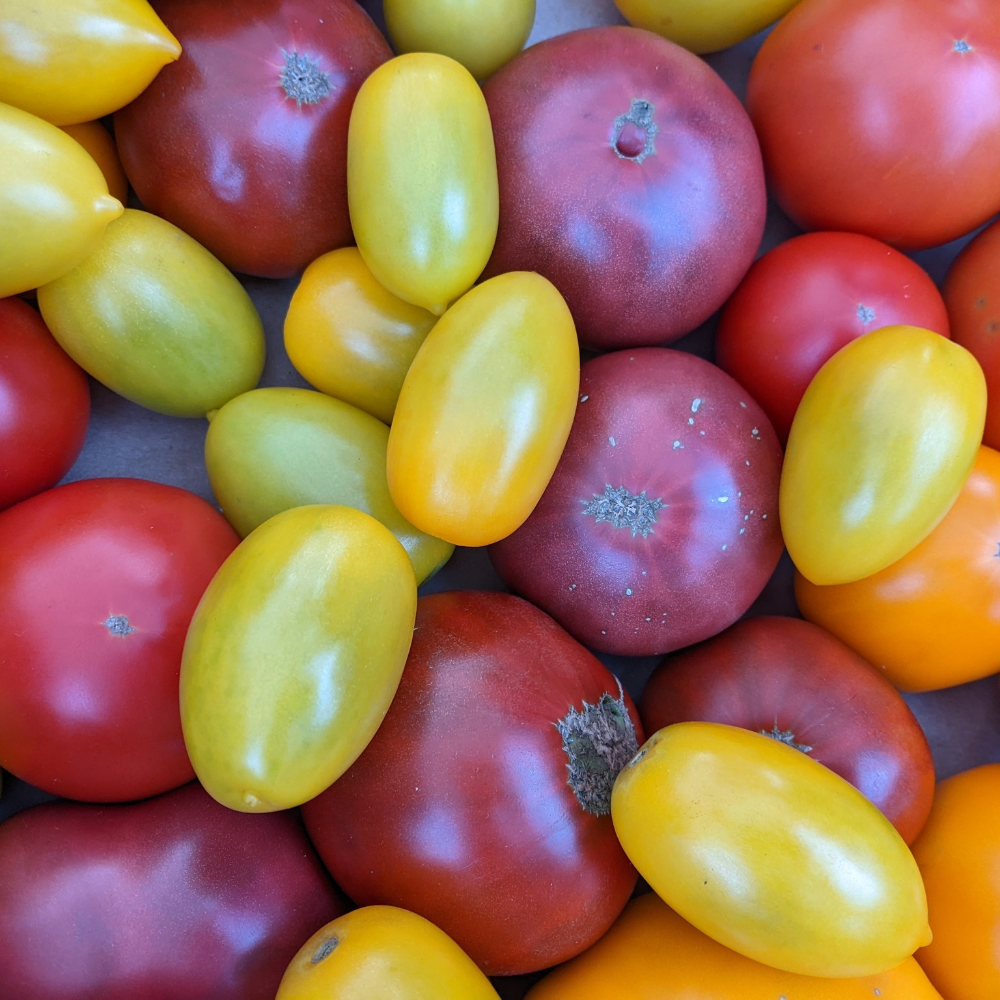

<h1>Comox Valley Farmers Market</h1>
<h2>Project Summary</h2>
<h3>What site you have chosen to redesign and build?</h3>

 I chose the Comox Valley Farmers Market for my project to rebuild and redesign due to many factors. I love to go to the farmers market on Saturday, but I've found that their website is not well organized and difficult to go through. On top of that the mobile version of the website is the same as the desktop version, which makes it difficult to navigate on the go. 

https://cvfm.ca/

<h3>Why do they need a new website?</h3>
<h4>What is the most important purpose of this website</h4>

The most important purpose of this website is to redirect and inform people and vendors about the Comox Valley Farmers Market.

<h4>Who is the target audience</h4>

There are two target audiences of this website. There are the vendors, which includes current and prospective vendors of the farmers market and ensuring that ther products are adequately advertised. There is also the people attending the farmers market to shop. This could be locals who regularly shop at the farmers market and tourists looking to see our local fares.

<h4>What is the overall message you are trying to convey to your target audience on this website? What action do you want the audience to perform before they leave your website? Are there multiple ways they could take action?</h4>

The overall message is to draw people and vendors in to participate in the Comox Valley Farmer's Market. Ideally you would have vendors apply to be included in the farmers market and also draw people in to shop and redirct them to the farmers market. Currently there are multiple ways within the website to be able to do both of these actions.

<h4>Why is their current site not appropriate?</h4>

Currently, just on the home page there are 40 Different Errors, 5 Contrast Errors, and 35 Alerts.

Most of the errors are alt text errors and when looking at the code you can see why. Currently the alt text doesn't describe what the image is. A simpler alt text for example like "Carrots and Beets" would make much more sense 

 There are also a few empty headers as well, which seems very unnescessary.

Unfortunately, there were a few contast issues where the background and text were not visible, for example here where the button is a light green and white text. Had they followed the same colour screen as next to it there would be less issues.

The lighthouse report unfortunately was not great as well, with the speed being affected likely due to the excess of unused CSS and the never-ending load of blog posts on the homepage.

The content on the page is not well organized and an excess of repeated information throughout the website, where a link to another part of the website could have been sufficient. When you switch from desktop to mobile the same informaton is shown, when ultimately not all of it was necessary on the mobile version of the site.

<h2> Look and Feel</h2>
<h3> Mood</h3>

 For the mood of the page I am aiming for something approachable and down-to-earth. Nothing to elaborate, and keeping the colours very earthy and organic looking, while still maintaining appropriate contrast levels.
<h3>Inspiration </h3>

 I found inspiration in two different websites, the Black Barn Farm's website and the BC Farmer's Market Trail website.

<h4>Black Barn Farm </h4>

https://www.blackbarnfarm.com.au/

 I really enjoyed the simple earthy colour palette they used for Black Barn Farm's website. I also like how their updates are organized on the desktop page, though i think less updates showing on the home page would be better. I really like how they had the google map and the grass layered over it was well.

<h4>The BC Farmer's Market Trail Website </h4>

 I think I drew the most inspiration from this website. I really liked the colours pallette they used, it's still earthy colours but a bit more vibrant than Black Barn Farm's. I also really liked how they set up the Follow Us section for mobile. It feels like a much more well organized website in comparison to The Comox Valley's Farmers Market's website. I also like the hero video they have and would like to incorporate a similar video on the desktop version of my webstie

<h3> Colours</h3>

 I found a colour pallete I enjoyed from pinterest that I think ties in well with The Comox Valley's Farmers Market's current colour pallete. I did adjust someo of the colours slightly when checking the contrast between them, but ultimately the same colours have been used in my design

<h3>Images</h3>

Luckily, The Comox Valley Farmer's Market has many images to choose from. I don't think I will need to use and stock images due to the surplus of images I have to choose from between their website and their social media pages. Each week on Facebook they post new photos, so there are a lot of options.

   
<h3>Fonts</h3>

 The fonts I'm planning to use Chewy for my headers and links and Poppins for my paragraphs and links. I wanted a font that was a bit more playful and fun for the headers, but another one that is easier to read for the paragraphs.

 

<h2> Website content</h2>
<h3>Homepage Content List</h3>
<h4>Header</h4>
<ul>
<li>Logo</li>
<li>Main Navigation
<ul><li>Home</li>
<li>About Us</li>
<li> Vendors</li>
<li>Blog</li>
<li> Market Calendar</li>
<li> Gallery</li>
<li> Apply Here</li>
<li?>Contact Us</li>
</ul>
</li>
</ul>
<h4>Hero Section</h4>
<ul>
<li> Heading "buy local - Comox Valley - eat local Farmers Market" </li>
<li> anchor button to view our location Map </li>
</ul>
<h4> About Us Section </h4>
<ul>
<li> About our Markets heading </li>
<li> paragraphs describing the market and how it works </li>
</ul>
<h4> Content Section</h4>
<ul>
<li> heading Explore our Markets </li>
<li>tile with the name of the market, time, and location</li>
<li>There should be multiple tiles as there are 4 different markets</li>
</ul>
<h4> Blog Section</h4>
<ul>
<li> A header "Latest From our Blog"</li>
<li> One tile for the most recent blog post with photo and brief description and button to read more </li>
<li> Second tile the same but for the second most recent blog post </li>
<li> Anchor button to link to read more blog posts </li>
</ul>
<h4> Call to Action</h4>
<ul>
<li> Header "Become a Vendor today!"</li>
<li> An anchor button to "Apply Here" page </li></ul>
</h4> Footer Section </h4>
<ul>
<li> Contact Us details like address and email </li>
<li> Map to how to get there </li>
<li> Land Acknowlegement </li>
<li> Badges for BC Farmers Market and Comox Valley Chambers </li>
<li> Social Media Links </li>
<li> copy right details </li></ul>

<h3>About Us </h3>
<h4> Header</h4>
<ul><li> Same as Home page </li>
<h4> Hero Section</h4>
<ul>
<li> background image similar to homepage </li>
<li>Heading "About Our Market" </li></ul>
<h4> History Section </h4>
<ul> <li> Heading: "How we got started"</li>
<li> Image of the market</li>
<li> text talking about how the market got started </li></ul>
<h4> FAQ</h4>
<ul><li>Header: FAQ about the Market </li>
<li> link to FAQ page</li>
<li> background image</li>
<h4>Our Sponsors </h4>
<ul><li>header: Ours sponsors</li>
<li> link to sponsors</li></ul>
<h4> Contact Us</h4>
<li> Header: "Stay in touch, join our newsletter" </li>
<li> Contact us sheet </li></ul>
<h4>Footer</h4>
<ul><li> Same info as homepage</li></ul>
